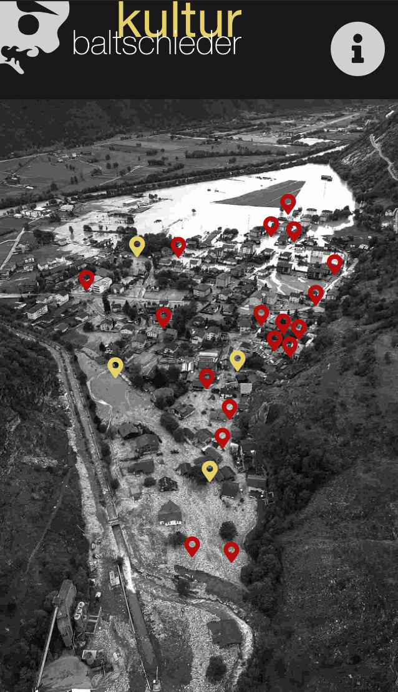
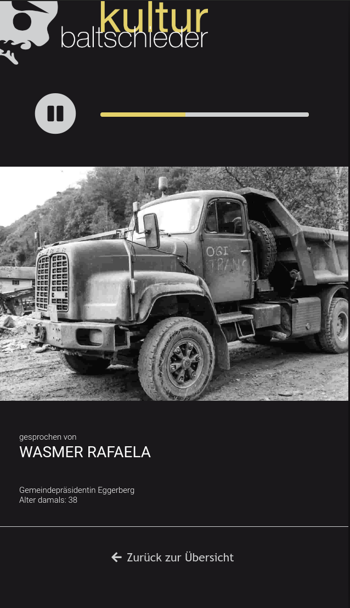
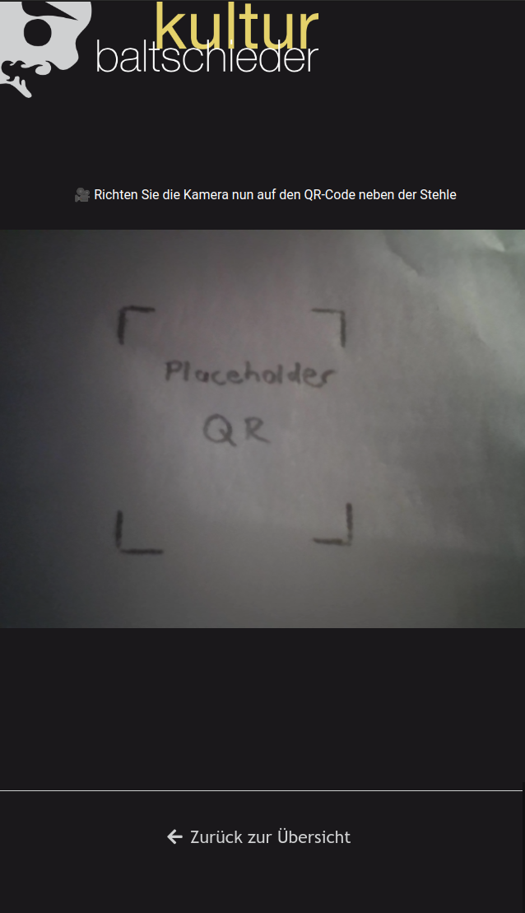

# Zeitzeugen

This web application was developed as part of the project "Zeitzeugen" of the cultural commission "kultur baltschieder" for the 20th anniversary of the storm in Baltschieder on 15.10.2000, which devastated a large part of the village. The project "Zeitzeugen" consisted of an exhibition of photos of the storm distributed throughout the town with QR codes that could be scanned with this web application and then showed a corresponding audio interview with a person affected. The application also featured a map of the village 20 years ago with markers that showed the position of the various stations, with yellow markers indicating which stations had been visited already. A special interview would appear as a reward as soon as one visited all of the stations. 

   

I was responsible for recording and editing the audio interviews and developing the web application.

## Development server

Run `ng serve` for a dev server. Navigate to `http://localhost:4200/`. The app will automatically reload if you change any of the source files.

## Build

Run `ng build` to build the project. The build artifacts will be stored in the `dist/` directory. Use the `--prod` flag for a production build.
